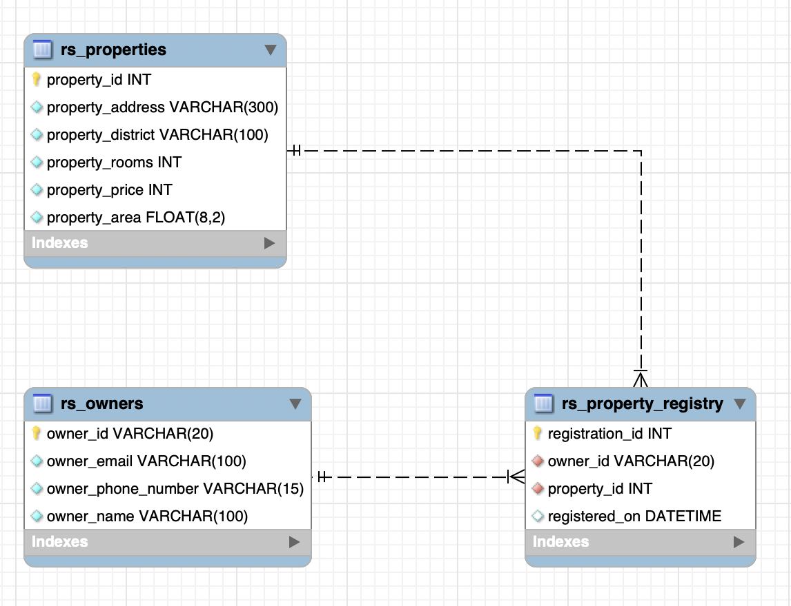

# Pre-Requisites

1. install brew [brew.sh](https://brew.sh/)
1. `brew update`
1. `brew install pyenv`
1. `pyenv install 3.9.12`
1. `npm install -g @aws-amplify/cli`
1. `pip3 install --user pipenv`
1. `pip3 install boto3`

# Assignment

This project was bootstrapped with [Create React App](https://github.com/facebook/create-react-app).

## Front-End

1. React + AWS Amplify
2. Uses 3rd party API to retrieve countries information [https://restcountries.com/v3.1/all](https://restcountries.com/v3.1/all)

## Back-End

1. AWS Lambda
2. DB MySQL (AWS)
3. Cloud Formation template available in docs/cloud_formation_template.yml

## Build Front-End

### `npm start`

Runs the app in the development mode.\
Open [http://localhost:3000](http://localhost:3000) to view it in your browser.

## Deploy to AWS

### `amplify push`

## DB

1. Scripts available in docs/create_db.sql
2. 

## API
1. OpenAPI3.0 Documetation available in docs/apivivienda-dev-oas30.yml
### Endpoints
1. GET /inmuebles : list all properties (Supports Filtering and Pagination)
2. POST /inmueble: Create a new property (Supports multiple properties for the same owner)
3. DELETE /inmueble/{id}: Deletes a property in cascade (All registry entries also removed)

## What is Missing

1. Unit and Integration Tests
2. Styling for the website

## This Was a fun challenge!!!